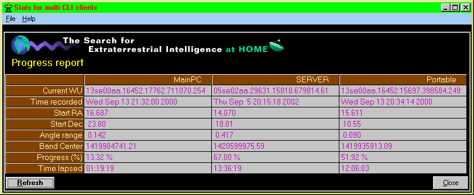

<div align="center">

## A SETI@Home progress report \- updated


</div>

### Description

setiMstats version 1.0.1

UPDATED: added error handling, fixed few bugs & added ability to add item from any .sah file in the SETI folder.

Display progress reports from multiple CLI clients running on

the same machine (different folders) or on a network of computers.

SETI@Home: The Search for Extraterrestrial Intelligence, at home!
 
### More Info
 
*.sah files from the SETI@Home applications.

Add-on to the SETI@Home application.

Progress report of the currently watched SETI clients.

None known.


<span>             |<span>
---                |---
**Submitted On**   |2002-10-14 12:01:24
**By**             |[BenoitC](https://github.com/Planet-Source-Code/PSCIndex/blob/master/ByAuthor/benoitc.md)
**Level**          |Beginner
**User Rating**    |5.0 (10 globes from 2 users)
**Compatibility**  |VB 6\.0
**Category**       |[Complete Applications](https://github.com/Planet-Source-Code/PSCIndex/blob/master/ByCategory/complete-applications__1-27.md)
**World**          |[Visual Basic](https://github.com/Planet-Source-Code/PSCIndex/blob/master/ByWorld/visual-basic.md)
**Archive File**   |[A\_SETI@Hom14603910142002\.zip](https://github.com/Planet-Source-Code/benoitc-a-seti-home-progress-report-updated__1-39790/archive/master.zip)

### API Declarations

```
GetPrivateProfileString
WritePrivateProfileString
ShellExecute
```


